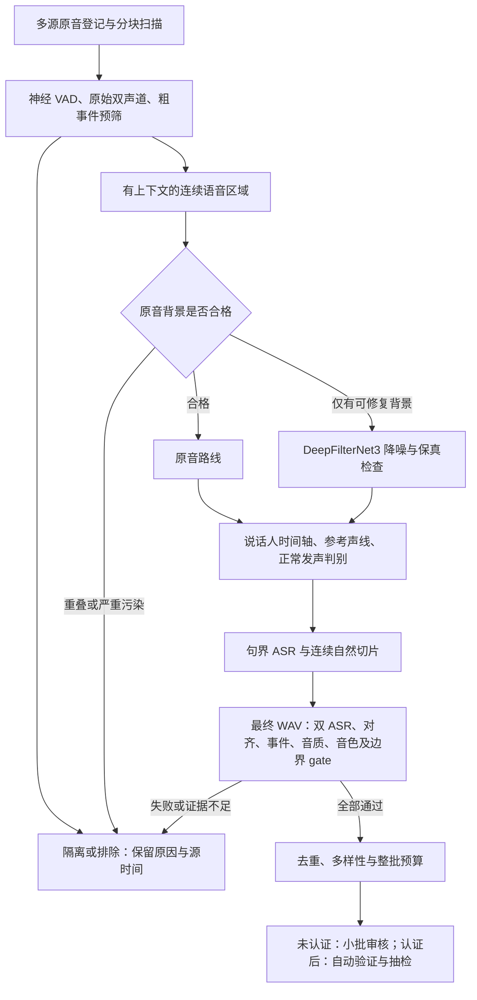

# 长音声音频：严格准入与少量审核方案

日期：2026-09-12。范围：多个 30–60 分钟的音声源，混有底噪、拟音、多角色、轻语、耳语、双耳录音及非语言发声。本文为代码复查与联网研究后的设计，新增 gate、模型和指标尚未实现或校准；任务状态见 [PLAN](../../PLAN.md)。后续按用户决定将失败的 UVR5 路线替换为 DeepFilterNet3，具体接入见 [DFN3 补充方案](long-form-deepfilternet3-v2-plan.md)。文档更新未运行分离、重新切片或训练。

## 1. 判断与目标

现有长音频模块已经支持多个文件、分块解码、恢复、ASR 和版本化导出。主要问题是筛选依据不足，以及把灰区交给了人工；不是缺少批处理入口。降噪尚未接入正式生产流程。用户报告 UVR5 失败，选定 DeepFilterNet3 作为后端；旧 DFN3 AB 听感问题保留为负面证据，通过新分块/边界处理与严格筛选重新验收，不继续等待 UVR。

采用“宁可少收，也不混入坏片段”的策略：先找正常说话区域，再按需处理背景，最后对最终音频逐项验收。初期只选目标正常声线、连续自然句、无明显空间效果和非语言事件的片段。轻语、耳语、角色变化和 3D 麦分别隔离，以后若要训练这些风格，应另建数据集与参考，不混入 normal。

自动检测不能证明每条都绝对无误。工程目标是：**联合 gate 通过集的片段级合格率，其单侧 95% 置信下界达到 99%，且验收中关键缺陷为零**。这是待验证目标，不是当前性能。未取得证据前输出 `strict_candidate` 小批审核；达到条件后才考虑有抽检的 `auto_verified`。任何必要证据缺失、冲突或超出已校准范围，都不能放行。

## 2. 现有流程的具体缺口

| 本地证据 | 对这类素材的影响 | 改动方向 |
| --- | --- | --- |
| `long_form_pipeline.py::_materialize_segments` 对宽松候选先算 embedding、基频，再 ASR/精筛 | 明显拟音、耳语和碎片也消耗较重计算；逐源加载模型 | 低成本预筛在前，同阶段跨源复用模型，重模型只处理幸存区域 |
| `long_form_pipeline.py` 调聚类时传 `reference_vector=None` | 最大簇只是本文件时长最多的声线，可能是角色声或耳语 | 接入版本化目标正常声线参考包，跨文件统一验证 |
| `long_form_grouping.py::cluster_speaker_embeddings` 使用全量 N×N 相似度与单链接合并 | A 像 B、B 像 C 可以把 A/C 连到一起；整片 embedding 看不到局部换人 | 有界聚类只作探索，准入依赖参考比对、片内稳定性和时间轴检测 |
| `long_form_grouping.py::suggest_styles` 最后的默认分支为 `normal` | 未触发相对音量/周期性/空间规则，不代表存在“正常发声”的正面证据 | normal 必须有正例匹配，角色/发声方式独立判断 |
| `long_form_features.py` 明示 `overlap_proxy_is_calibrated=False` | 频谱平坦度和活跃度代理不能证明没有第二个人声 | 增加真正的重叠语音检测和说话人转折边界 |
| `long_form_refinement.py::_quality_exclusion_reasons` 继承父片段 normal/最大簇；子片段 SNR 缺失时回退父值 | 重切后的污染片段可能借用干净父片段的标签或分数 | 最终片段重新判定；未知值隔离，不回填通过 |
| 单路 ASR 均值 ≥0.78、SNR 代理 ≥15 dB 等现有门槛 | 不能独立证明文本准确、无拍击、无角色变化；平均值会稀释瞬态问题 | 独立 ASR 一致性、事件时间轴、局部最差窗口和真实盲听校准 |
| 每源最多 40 条，而非整批预算 | 新 6 源仍需审 205 条；减少条数本身不提高正确率 | 先硬 gate，再批次预算和多样性选择；灰区不自动进日常审核 |

现有 6 源约 4.75 小时，产生 1,683 个宽松候选、2,057 个语义单元，首轮 205 条/824.969 秒。历史 31 条 normal 导出只证明旧审核通过，不能直接当作新标准的“绝对干净”标签。20 组 DeepFilterNet AB 中 speaker cosine 最低仍达 0.9832，人工却否决了听感，已经说明声纹相似和技术格式通过不等于可训练。

## 3. 联网依据与组件选择

以下只使用官方实现、模型卡、论文和 NIST 方法说明。网页访问日期为 2026-09-12；未来实现时还要固定实际模型 revision、权重哈希和依赖，不能把网页最新版本自动替换进当前环境。

| 能力与一手来源 | 已核实事实 | 本项目采用方式与边界 |
| --- | --- | --- |
| [Silero VAD](https://github.com/snakers4/silero-vad)、[状态说明](https://github.com/snakers4/silero-vad/wiki/FAQ) | 提供神经 VAD，支持 8/16 kHz；流式模型需要维护连续块的状态 | 作为语音提议器，跨块延续状态、跨文件重置；VAD 命中不能证明有有效台词或正常音色 |
| [pyannote Community-1](https://huggingface.co/pyannote/speaker-diarization-community-1)、[官方模型说明](https://docs.pyannote.ai/models) | 提供常规与 exclusive diarization；输入会转为 16 kHz mono；exclusive 每时刻只保留一个说话人 | 用常规输出及重叠检测证据检查时间轴。exclusive 仅辅助文本对齐，不能据此声称无重叠；先保留原始立体声特征。下载需要接受模型条件，接入前检查本机可用性 |
| [SenseVoice](https://github.com/QwenAudio/SenseVoice) | 已发布 Small 支持中/粤/英/日/韩，兼有语言、情感和 BGM/笑/哭/呼吸等事件标签 | 优先复用本地已固定的 SenseVoice 配置作第二路中文 ASR，保留原始事件标签。`NEUTRAL` 是情感标签，不能替代 normal 发声分类；粗事件标签不能包办拟音检测 |
| [YAMNet 官方实现](https://github.com/tensorflow/models/blob/master/research/audioset/yamnet/README.md) | 521 类事件，约 0.96 秒窗口、50% 重叠，可获取每窗多标签分数 | 候选事件检测器，校准音乐、耳语、笑声、拍击/摩擦等相关类别；保留峰值与命中时间。近 1 秒窗口不能精确定位毫秒级拍击，需结合瞬态特征与域内样本 |
| [DNSMOS 官方评分代码](https://github.com/microsoft/DNS-Challenge/blob/master/DNSMOS/dnsmos_local.py) | 16 kHz、9.01 秒输入窗口；短输入通过重复音频补长；分别预测 SIG/BAK/OVRL | 作为音质证据候选，不能把短片重复后的分数当作未经验证的真实 MOS。短片要单独校准；带上下文评分须明确标为上下文分数 |
| [NISQA](https://github.com/gabrielmittag/NISQA)、[训练语料说明](https://github.com/gabrielmittag/NISQA/wiki/NISQA-Corpus) | 预测总质量、噪声、音色失真、断续和响度；语料主要为通信场景 | 作为 DNSMOS 的对照候选，在本地盲听上比较增益后选用；不默认两个模型都全量运行，也不把 NISQA-TTS 的合成语音自然度用于原始素材洁净度认证 |
| [DeepFilterNet](https://github.com/Rikorose/DeepFilterNet) | 全带宽语音增强，有模型/变换延迟补偿选项 | 用户已选定 DeepFilterNet3；复用 0.5.6/已有权重，主要处理稳定底噪，加入长音频适配并验证延迟、音色和尾音；旧 AB 不自动转为合格产物 |
| [UVR 官方项目](https://github.com/Anjok07/ultimatevocalremovergui) | UVR 承载 VR、MDX、Demucs 等不同分离模型 | 历史候选方案；用户报告失败，当前取消该依赖。由其分离目标推断，Vocal 也不等于目标角色、正常发声或无前景拟音 |
| [WhisperX 限制说明](https://github.com/m-bain/whisperX) | 强制对齐有语言/词典约束，重叠语音和说话人识别仍有限制 | 不用“能对齐”替代“文字正确”；先独立转写一致，再检查字词边界和覆盖 |
| [Qwen3-ASR / ForcedAligner](https://github.com/QwenLM/Qwen3-ASR) | 提供 0.6B/1.7B ASR，以及支持中文的独立强制对齐模型 | 本地已有 Qwen ASR 配置，可作候选对照；当前配置关闭 timestamps，不等于已接入 aligner。比较后固定一种中文对齐实现，不同时堆叠多个对齐器 |
| [WeSpeaker](https://github.com/wenet-e2e/wespeaker) | 提供多种说话人验证模型与评分校准能力 | 现有 CAM++ 先接参考；若需要第二验证器，选不同模型族并证明增益，两个 CAM++ 包装器不算独立验证。声纹身份仍不能替代同演员角色风格检测 |
| [Selective Classification 论文](https://arxiv.org/abs/1705.08500) | 研究通过拒绝不确定样本，权衡覆盖率与错误风险 | 借用“允许弃权”的设计，不把论文的其他数据集保证迁移到本项目；需验证最终联合 gate |
| [NIST 精确二项区间](https://itl.nist.gov/div898/software/dataplot/refman2/auxillar/exacbino.htm) | 支持单侧置信界；小样本/零失败时正态近似可能不可靠 | 用于说明“抽查没发现问题”不等于 100% 正确，并设计固定留出集验收 |

组件的选择是基于上述能力与本地代码的工程判断；这些来源都没有证明现成组合能够无误筛选本项目的音声。

## 4. 新流程：廉价预筛 → 条件增强 → 严格复检

### 4.1 长文件与处理顺序

1. 原音只读，逐文件登记哈希、采样率、声道、时长。使用有界流式块，不把多小时原音或全部候选 PCM 放入内存。分析可以 16 kHz，最终训练音频保留既有 48 kHz PCM24 契约；上采样不证明源音高频质量。
2. 原始 L/R 上计算局部能量差、相关性、声像移动、Mid/Side、削波和瞬态；保留时间轴。神经 VAD 与能量特征生成宽松提议。预筛对明确非语言/严重污染区域停止重计算；低置信结果进入隔离而非误认为正常。
3. 连续区域内检测说话人变化、重叠、风格与事件。长文件分块时保留重叠上下文，拼接时间轴并消解边缘重复；不同文件的 `speaker_000` 不代表同一个身份。不把 diarization 强制设置成一人来制造无重叠结论。
4. 仅对有价值的语音区域做句界 ASR。角色/重叠/事件边界附近留保护区，无法找到完整自然句就放弃，不截取残词凑长度。
5. 第一版严格候选优先 3–12 秒的连续自然句；2–3 秒和 12–15 秒属于待单独校准范围。现有硬契约仍为 2–15 秒。旧版跨区间压缩停顿不作为首批严格候选默认路线，避免增加韵律和连接伪影变量。
6. 复用已经实现的 v2 边界渲染，但在实际最终 WAV 上复检；零首尾只能证明端点处理，不能证明没切掉辅音、齿音或尾音。父片段标签仅为上下文，不能当作子片段准入证据。

### 4.2 底噪、拟音与 DeepFilterNet3

| 区域类型 | 默认处置 | 复检重点 |
| --- | --- | --- |
| 原音已干净 | 原音直通后级 gate | 保留自然音色，不强制增强 |
| 稳定空调/电流/环境底噪，有完整正常台词 | 使用选定的 DeepFilterNet3 条件降噪路线 | 背景改善必须与人声完整性同时成立，按新版 profile 和 gate 验收 |
| 音乐/拟音混合，但存在正常语音 | 首先避开事件时段；仍与台词混合则隔离/排除，不等待 UVR | 不假定 DFN3 能移除前景拟音；成品中的任何可信残留事件触发 gate |
| 重叠说话、密集拍击贴着人声、角色声、耳语主导 | 默认排除或隔离 | 不依赖昂贵分离去“修成”正常台词 |

当前 UVR5 路线已由用户取消。DeepFilterNet3 接入先使用已有 0.5.6 权重与保守 8 dB 起点，关闭额外 post-filter、启用延迟补偿；先找连续可用区域，再带真实上下文处理。初始核心块上限 30 秒、两侧各最多 2 秒上下文，均须验证；现有高层 API 逐次重置模型隐藏状态，不能直接拼成声称无缝的流。跨缝句子完整重处理或隔离。详细参数、缓存指纹、试点和异常处理见 [DFN3 补充方案](long-form-deepfilternet3-v2-plan.md)。

增强分支保存原音、增强音、模型参数、各自哈希和精确时间映射；验证固定延迟及长文件漂移，不能只比较总时长。原始立体声的角色/空间证据不能被增强后的 mono 结果抹掉。去除背景噪声允许原音背景 gate 失败，但原音已有的换人、重叠、非 normal 风格不能借增强自动豁免。增强音必须通过所有最终 gate。

### 4.3 目标声线、正常发声和语气词

- 建立 6–12 条、每条约 3–10 秒的正常声线参考包，覆盖几个自然语速/句调和来源。先复用历史已审样本挑选，但按新洁净度标准重新确认参考；不用最大簇自动生成“真值”，不用待验收片段自动更新参考。
- `speaker_identity`、`vocal_style`、`spatial_style`、`event_labels` 分开存储；“同一个演员”与“同一正常声线”是两项检查。轻声正常发声、气声、耳语、夸张角色、哭笑等需本项目的正负例定义。
- CAM++ 对固定参考验证身份，并在有足够语音的子窗口检查稳定性。normal 必须同时匹配正常参考分布，并通过域内发声/角色分类器；基频、周期性、谐噪比/CPP、谱倾斜及响度只作辅助，不能仅凭 F0 或音量划线。数据不足或模型分歧就隔离。
- 校准负例必须包含“同演员换角色但声纹很像”“有清楚文字的耳语”“无明显左右移动的近讲/双耳声”“人声清楚但夹一次拍击”。只用不同人的正常语音作负例会漏掉本项目关键风险。
- 纯“嗯、啊、哈”、连续非语言发声、笑/哭/呻吟/刻意呼吸为主的片段不进入 normal。正常句子中的“嗯，我知道了”“好啊”等保留真实文字和自然语气；不按字表机械删除语气词，也不从词中间剪掉声音。普通低强度换气与表演性呼吸用标注准则区分。

## 5. 必须全部成立的 gate

评分只能在内容硬 gate 通过后用于排序，不能以高 SNR 抵消错误角色或文本不一致。G0–G8 每项返回 `pass / fail / unknown` 和证据；必要模型未加载、分数无效、分析窗不够均为 `unknown`，整条隔离。G9 另外检查适用域与发布资格：偏域或证据无效仍隔离；内容检查全部通过、适用域已明确，但联合认证尚未完成时，只能是 `strict_candidate`，由人工确认实际交付项。所有 gate 和自动认证均通过才可为 `auto_verified`。模型阈值尚未标定的开发样本只能标为校准样本，不能借这一状态转换绕过内容 gate。

| Gate | 放行证据 | 否决/未知情况 |
| --- | --- | --- |
| G0 来源与文件 | raw/final 哈希、源采样范围、变换映射完整；格式、有限样本、时长正确 | 旧批准复用到新音频、无法追溯、损坏/削波超限 |
| G1 有效语言 | 真实连续语音、足够可训练台词，语言匹配目标数据集 | 纯语气音、非语言主导、静音被识别成台词、语言不确定 |
| G2 单人及时间稳定 | 常规 diarization/重叠检测通过；句内无换人、无边界跨越 | 任何可信重叠证据、声线转折、检测缺失；exclusive 单人输出不算证据 |
| G3 目标身份 | 固定多参考评分、片内一致性均在域内校准范围 | 只匹配最大簇、参考缺失、局部偏离、多个模型冲突 |
| G4 正常声线及空间 | 正常发声正例判别成立；原始 L/R 局部空间 gate 通过 | 角色/轻语/耳语/双耳风险、只用 `NEUTRAL` 或规则默认值放行 |
| G5 事件与音质 | 最终音频的事件窗、瞬态、背景和语音质量全部通过；48 kHz 波形/频谱完整 | 拍击、摩擦、BGM、笑哭等污染；金属/水声；只有片均值好看；必要质量证据缺失 |
| G6 文本与边界 | 两个不同模型族独立转写一致，中文对齐覆盖、词间间隔和字词完整性通过 | 数字、专名、否定词、语气词等实质分歧；异常重复；缺首尾字；仅强制对齐成功 |
| G7 增强保真 | 增强路线的 raw/final 对齐、台词、身份、正常声线和频谱/盲听校准通过；原音路线明确标为 identity transform | 延迟/漂移不明、台词改变、擦掉音节、角色证据被掩盖；未知不能当原音直通 |
| G8 最终成品 | 自然完整句；渲染后重新测质量/ASR/风格；无连接伪影；内容与来源去重 | 父标签替代子片复检、压缩拼接尚未校准、重采样或裁剪改变内容 |
| G9 适用域与发布资格 | 自动发布要求该参考包、模型、阈值、声学范围及 raw/增强路线已联合验收 | 偏域/证据失效则隔离；仅联合认证待完成时标 `pending_certification`，最多进 strict_candidate，不能自动入库 |

阈值冻结前先做校准配置草案，不直接硬编码“cosine 0.85 / MOS 4.0 就安全”。本计划只先冻结政策：首批范围 3–12 秒、无可信重叠/非 normal 事件、双 ASR 的规范化文本完全一致；连续模型阈值由域内正负例和盲听确定。`T_identity`、`T_normal`、`T_event[class]`、`T_noise`、`T_quality`、`T_alignment` 未标定时，生产 gate 不得宣告通过。开发态可以输出明确标注的试验候选供校准，不能冒充已认证结果。

G5 的背景分析不沿用“有效语音区与低能量帧的差就是实际 SNR”的解释。保留代理分数名称，区分真实非语音上下文与程序插入的静音；不能回填父片段 SNR。如果没有可用静音，不把缺失算成无限大 SNR，改用已校准的无参考质量分支，否则隔离。DNSMOS 的短片重复/上下文输入方式要写入分数身份；分支尚未验证就不能放行短片。事件检查保存逐窗峰值、分位数、命中时段及持续时间，避免一次拍击被全段平均掩盖。

G6 优先比较现有 Whisper 与 SenseVoice 两个模型族。只统一标点、空白、大小写及经验证的文字表示，不删除实质字符来提高一致率；数字书写转换应保留原文与规范化映射。相同不等于真实正确，仍需声学覆盖和留出集验收。第二路在最终短片上跑，不能用同一个父片段转写剪出两份“独立结果”。若启用第三路 Qwen，仅用来诊断或有限校准，不以简单多数票把分歧强制变成通过。现有 SenseVoice 配置无时间戳、Qwen 配置未启用对齐，接入时需保留原始事件输出并新增独立中文对齐步骤。

## 6. 人工量如何真正下降

| 分区 | 定义 | 默认是否出现在审核页 |
| --- | --- | --- |
| `strict_candidate` | 内容 gate 全部通过但尚未获得自动发布资格，等待小批确认 | 是，受整批预算限制 |
| `auto_verified` | 全部 gate 与联合验收条件通过，带版本化自动证据 | 认证机制实现并验收后，仅抽检 |
| `reserve_budget` | 合格但超过本批预算/多样性需要 | 否，按需展开 |
| `quarantine` | 灰区、证据不足、偏域、模型分歧 | 否；只抽少量有价值案例做校准 |
| `reject` | 明确不满足目标集政策或技术要求 | 否，保留理由和来源 |

**试点批次预算：新 6 源合计最多 24 条，每源最多 6 条，两个上限同时生效。** 若全部达到 gate 则相较旧 205 条，默认送审数量上限减少约 88.3%；这是待实现的预算，不是已实现的准确率或实际削减结果。合格不足就少交甚至交零条，不补入灰区。超额合格项保留，不反复推送同一批。

第一次仍需定义目标正常声线和少量难负例，这是一次性标定工作，与每批审核分开记账。优先利用历史 40 条人工决定与 20 组 AB 结论，补充新标签按不超过 12 条的小批递进；参考选择计入新增标注总量。不得把旧保留、技术 AB 通过或自动排除直接当成新标准真值。校准期可从隔离区选每批最多 6 条信息量高的样本，日常页默认关闭该队列，不把全部灰区变成必审待办。

界面提供最终音频、原音对照与上下文、两路文字差异、风险发生时间、准入证据和单步保留/拒绝。已有模型证据预填，不让人重复勾所有技术字段。人工改动文字、边界或音频后，要重新检查对应依赖，禁止继承旧批准。

后续自动发布模式的随机抽检量按批次规模、来源覆盖和风险确定，记录实际人工分钟数；发现关键假阳性时暂停该版本/路线放行、隔离受影响的未冻结批次并复核。不能一边把未抽样条目标成 `human_confirmed`，一边宣称人工量下降。

## 7. 怎么验证“严格”而不只是把数量截短

1. 建立标注规范：合格必须同时满足目标声线、正常发声、单人、无污染/伪影、台词正确、完整边界。关键缺陷包括错人/角色、重叠、可闻拟音/音乐、错误或遗漏台词、切词和增强损伤。每条保存分项标签，不只有“喜欢/不喜欢”。
2. 正常参考集、阈值开发集、最终留出集分开；优先按源文件拆分，数据少时按不相邻长时间块拆分并标明外推限制。相邻切片、raw/DFN3 对、重复台词不跨拆分。难负例用于能力测试，不能冒充按真实分布随机抽取的通过集。
3. 先在开发集选保守阈值，再冻结模型、参考、阈值和抽样方案。留出集只做验收，失败后改阈值须换新留出证据；不要反复查看同一留出集直到它通过。样本不足时继续小批人工确认，不把普通反复抽查包装成固定 95% 保证。
4. 统计最终联合 gate 的 precision、coverage、各缺陷假阳性率、按源/时长/原音与增强路线的结果、有效入库分钟/源小时、人工分钟/入库分钟和计算 RTF。模型分数相关，不能把各自错误概率相乘来宣称联合准确率。
5. 在独立同分布的二项假设下，n 条抽检零缺陷时，单侧 95% 缺陷率上界为 `1 - 0.05^(1/n)`。20 条零错仍约为 13.91%，40 条约 7.22%；299 条零错才低于 1%，598 条零错才低于 0.5%。这些数由上式计算，不是要求现在一次审 299 条。需要更低人工成本时，先维持少量严格候选逐条确认，随使用积累独立验收数据。[方法依据](https://itl.nist.gov/div898/software/dataplot/refman2/auxillar/exacbino.htm)
6. 来自同一音声的相邻片段高度相关，不能把它们直接当作 299 个独立实验。按源/时间块分组报告和评估相关性；有限批次不放回抽检若宣称该批质量，应使用相应有限总体方法。参考或增强路线变更、声学域漂移后重新验证，不沿用旧置信声明。

自动免逐条审核的升级必须同时具备：联合通过集达到目标置信下界、关键缺陷验收为零、域内难例覆盖、证据/状态契约可审计，以及回退机制。少量盲听只适合验证试点方向，不能代替自动发布认证。

## 8. 实现与性能边界

- 当前代码不改为无条件自动导出。未来新增版本化 gate 契约与 ADR，区分 `candidate`、`human_confirmed` 和 `auto_verified` 文本/接受状态；后者必须绑定有效认证报告。保留现有人工事件与 v1 导出，不回写或批量“升级”历史结论。
- 缓存键包含源/增强/最终 WAV 哈希、采样范围映射、模型与权重、参数/代码版本、目标参考包、校准报告和文本规范化版本。每个 stage 独立提交成功/失败/未知，修改参考只重算依赖的 stage，已被版本验证的原始分析可复用。
- GPU 默认一次只跑一个重阶段；DFN3、ASR 和说话人检测按阶段调度，同阶段跨源组成受控小批，加载一次复用，完成后释放再切换模型。当前无 UVR 等待依赖；资源占用在实际运行前检查，契约、CPU 流式预筛、缓存、队列和合成回归可先推进。
- 对 30/60 分钟单源及至少现有 6 源批次做基准，记录阶段耗时、模型加载次数、重计算次数、峰值 RSS/VRAM、缓存命中和处理覆盖时长。初期不承诺未经测量的加速倍数；以相同输入、质量标准和处理范围比较。
- 模型权重先检查现有缓存，新增运行时放隔离环境并固定依赖。先小样本验证兼容性、事件标签与置信输出，再做全批；不能下载后就因模型存在而把 gate 标为可用。
- 多阶段中断/OOM/错误重试不丢成功结果，未完成检测阻断该候选。长时间扫描保留进度；避免每次恢复重新加载所有模型、全量计算 N×N 聚类或重复降噪已成功的区域。

## 9. 本次决策

按用户最新决定，实施 LF-12 严格筛选与 LF-13 DeepFilterNet3 接入。流程为“连续区域预筛 → 原音/DFN3 分流 → 逐项严格筛选 → 小批确认 → 有证据后抽检”，不再等待 Vocal stem。保留旧 DFN3 AB 的失败观察，用来验证新边界处理与拟音排除是否奏效。不再沿用旧 79% 保留率估算新流程产量；严格筛选很可能收得更少，先测合格分钟数与多样性，再决定补料和训练。

首轮研究更新时只修改 PLAN、README 与本文，本地链接检查通过，既有全项目单元测试 263/263 通过（22.922 秒），`compileall -q src scripts tests` 通过。后续 DFN3 路线补充另有记录；历史测试结果不证明本文尚待实现的 gate 或 DFN3 生产适配已有效。
